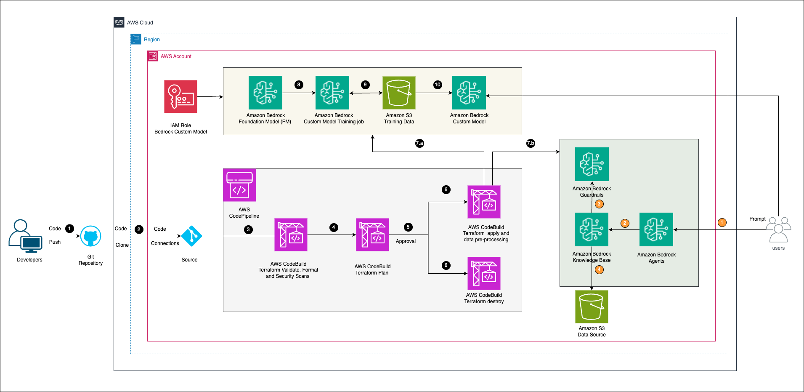

# Customer Bedrock model deployment



This repository contains sample code demonstrating how to use Terraform to provision a custom model using Bedrock with a dataset which answers some common banking questions for an existing or prospective customer.

The root Terraform module configuration provisions the below components into a subnet of your choice with the necessary security group attached.

* Amazon Bedrock
    * Bedrock Custom model training job and a custom model on successful run of the training job.
    * Bedrock Guardrail
    * Bedrock Knowledge Base
    * Bedrock Agents
* Amazon Opensearch Collection and Index
* Amazon S3
* AWS IAM

> [!IMPORTANT]
> A destroy operation on the stack doesn't delete the custom model training job, but rather stops it. Keep in mind that that the name of the job has to be unique on an account. We are using the random provider to generate a custom name for the new deployments of the stack.


The solution uses the dataset `SohamNale/Banking_Dataset_for_LLM_Finetuning` and generates training data in the form of a jsonl file for the format below.

```
{
    "prompt": "What is a bank account?",
    "completion": "A bank account is a deposit account held at a financial institution that allows a customer to store money and perform financial transactions."
}

```

The training dataset is uploaded to an S3 bucket created as part of the stack and referenced as as the training data for the custome model training job. The job ,when finished fine tuning the foundation model ,creates a custom model which can be used using a provisioned throughput with a no commitment or term based commitment based on your choice.


> [!NOTE]
> The current version of the sample does not have a complete version of the pipelines used in the current architecture. This note will be removed once the CodePipeline pipeline structure is updated in the repo.